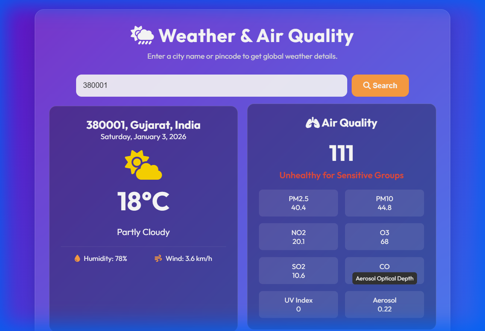

# Global Weather App

A fast and responsive weather application built with Vanilla JS, HTML, and CSS. 



## Features
- **Global Search**: Supports City Names (e.g., "New York", "London") and Postal Codes (e.g., "380001", "10001") worldwide.
- **Robust Geocoding**: Uses a smart fallback system (Open-Meteo Primary -> Nominatim Backup) to ensure locations are found even when one API fails.
- **Detailed Weather**: Shows Temperature, Condition, Wind Speed, and Humidity.
- **7-Day Forecast**: Weekly weather predictions with clear icons.
- **Air Quality Index (AQI)**: Real-time air quality monitoring with health status indicators.
- **Responsive Design**: Works seamlessly on desktop and mobile.

## How to Run
1. Clone the repository:
   ```bash
   git clone https://github.com/PATEL-BHAVIK2306005/Front-End-Weadher-Application-Via-Open-source.git
   ```
2. Open `index.html` in your browser.

## Technologies
- **HTML5 & CSS3**
- **JavaScript (ES6+)**
- **APIs**: Open-Meteo (Weather/Geocoding), OpenStreetMap Nominatim (Geocoding Fallback)
